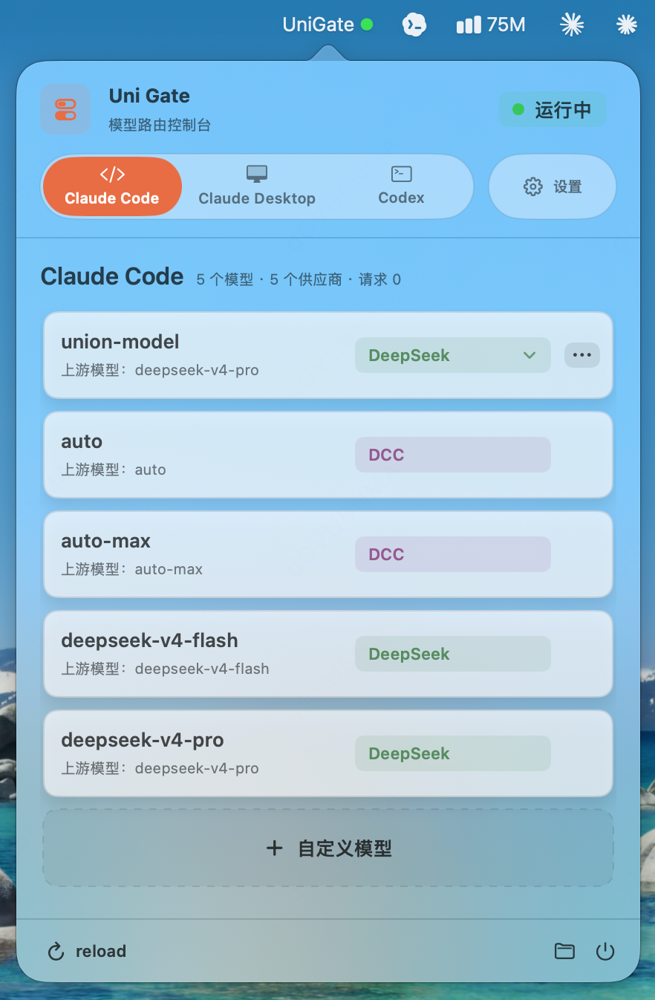
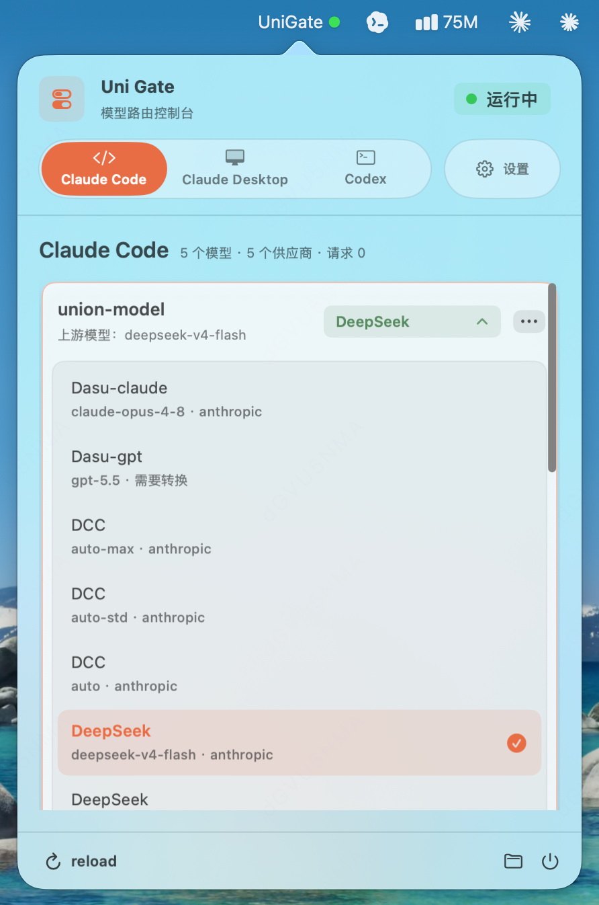
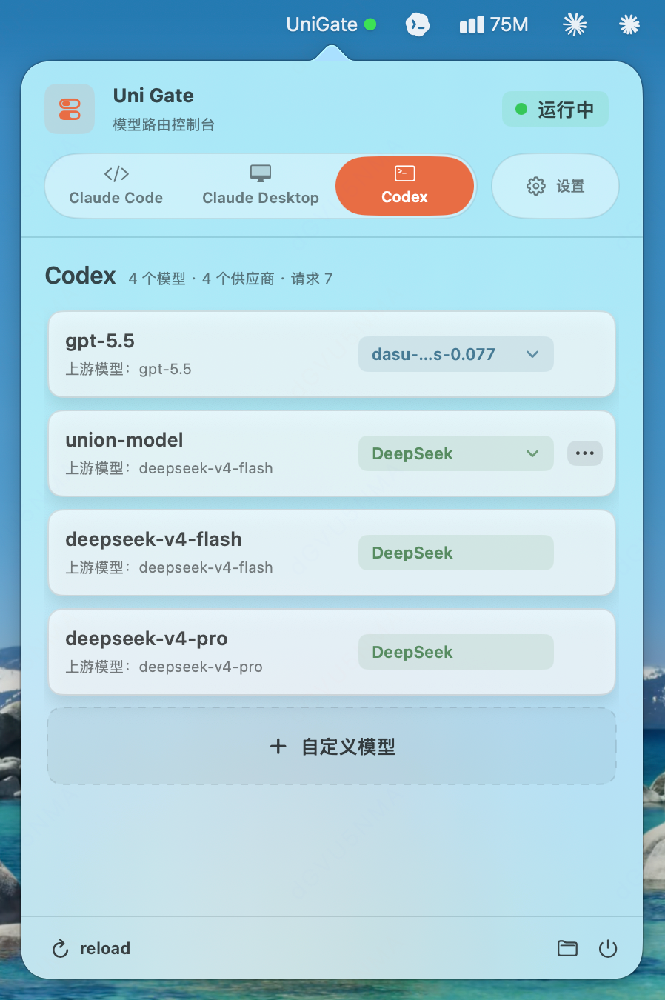
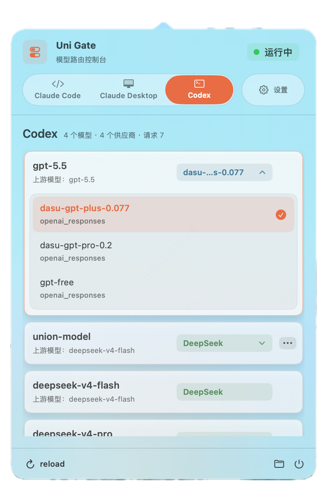
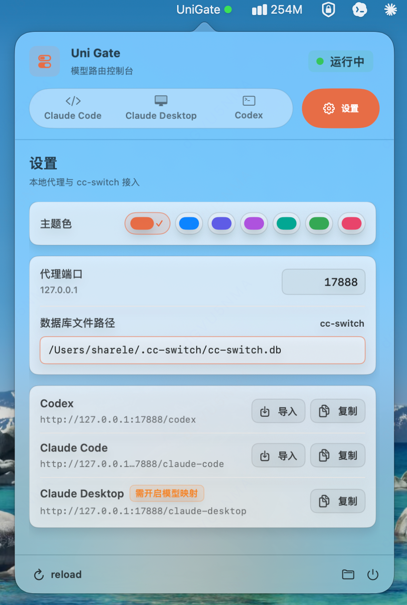
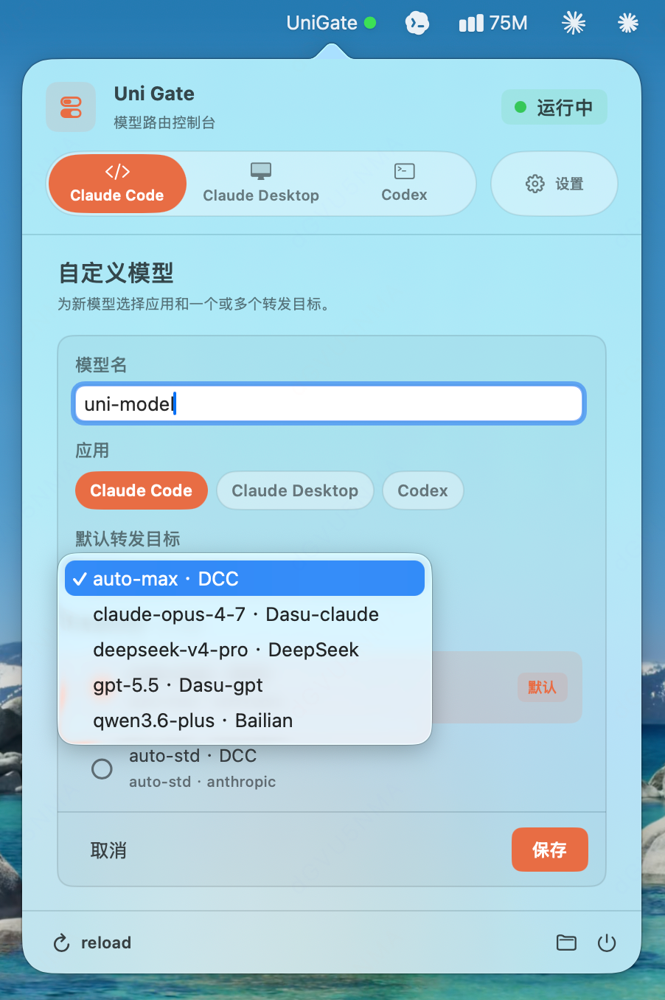

# Uni Gate

Uni Gate 是一个 macOS 菜单栏应用，用来接管 `cc-switch` 的本地路由能力，并在不修改 `cc-switch.db` 的前提下，为 Codex、Claude Code、Claude Desktop 等客户端提供模型级转发。

它读取 `cc-switch` 里已经配置好的供应商、密钥、模型目录和协议信息，然后在 UniGate 内维护“模型 -> 实际供应商”的路由状态。客户端只需要请求 UniGate，本地菜单栏里就可以实时切换每个模型背后的供应商。

> 说明：当前安装包和 macOS app bundle 仍沿用 `CC Uni Gate.app` 命名；应用界面中显示为 `Uni Gate`。

## 示例截图

| | | |
|---|---|---|
|  |  |  |
|  |  |  |

## 核心功能

### 多供应商热切换

同一个模型可以对应多个实际供应商。例如 `gpt-5.5` 可以同时有这些上游：

```text
gpt-5.5
  kiro
  pro20x
  plus
  ...
```

在菜单栏点击 `Uni Gate` 后，可以直接切换到任意供应商，路由立即生效。Codex、Claude Code 或 Claude Desktop 不需要重启，也不需要重新写配置文件；后续请求会直接走新的上游供应商。

这个能力适合这些场景：

- 同一个模型有多个供应商，临时切到更快或更稳定的一个。
- 某个供应商异常时，快速切到备用供应商。
- 对比不同供应商的速度、稳定性和回答质量。

### 自定义 Uni 模型

自定义 Uni 模型用于把多个模型聚合成一个统一入口，也可以直接绑定全部已有模型。例如可以创建一个模型名：

```text
uni
```

然后把它绑定到多个已有模型和供应商：

```text
uni
  gpt-5.5 -> openai
  gpt-5.5 -> pro20x
  claude-opus-4.8 -> cc
  deepseek-v4-pro -> deepseek
  glm5.2 -> glm
```

客户端始终只请求 `uni`，但你可以在 UniGate 菜单栏里把 `uni` 热切换到任意已绑定目标。这样就能实现“一个模型名，任意切换到其他模型或供应商”。

如果希望客户端经由 `cc-switch` 直接看到并请求这个自定义模型名，需要同时把 `uni` 加到 `cc-switch` 中 UniGate 自供应商的模型清单里。UniGate 会用这份清单控制基础模型的可见范围；自定义模型可以在 UniGate 中维护，未加入清单时在客户端侧可能不可见或不可选。

这个能力适合这些场景：

- Codex 或 Claude Code 里只想固定写一个模型名。
- 想用一个统一模型名承载日常默认模型。
- 想在不同模型之间快速试错，而不频繁修改客户端配置。

## 使用方式

### 1. 下载并启动 Uni Gate

从 GitHub Releases 下载最新 macOS 包：

[https://github.com/ShareLer/cc-uni-gate/releases](https://github.com/ShareLer/cc-uni-gate/releases)

下载 `CC-Uni-Gate-v*-macos.zip`，解压后运行：

```text
CC Uni Gate.app
```

当前发布包使用 ad-hoc 签名，没有 Apple Developer ID 公证。首次打开时，如果 macOS 拦截直接双击打开，可以按住 Control 点击 app 后选择“打开”。如果系统仍提示 app 已损坏，可以在确认文件来自本项目 GitHub Release 后移除 quarantine 标记：

```bash
xattr -dr com.apple.quarantine "/path/to/CC Uni Gate.app"
```

启动后菜单栏会显示 `Uni Gate` 和状态灯：

```text
Uni Gate ●
```

状态含义：

- 绿灯：UniGate 代理正常运行。
- 黄灯：UniGate 正常，但实际供应商请求失败。
- 红灯：UniGate 本地代理异常，例如端口未监听。

### 2. 配置 cc-switch 数据库路径

打开 `设置 -> 通用`，确认 `cc-switch` 数据库路径。

默认路径：

```text
~/.cc-switch/cc-switch.db
```

如果你的 `cc-switch.db` 放在其他位置，可以在设置页修改。

### 3. 把 UniGate 导入到 cc-switch

在 `设置 -> 通用` 里，可以把 UniGate 的本地地址导入到 `cc-switch`。

推荐至少导入：

```text
Codex:       http://127.0.0.1:17888/codex
Claude Code: http://127.0.0.1:17888/claude-code
```

导入后，在 `cc-switch` 里选择 UniGate 作为当前供应商。这样客户端仍然从 `cc-switch` 获取配置，但请求会进入 UniGate，再由 UniGate 转发到实际供应商。

Claude Desktop 需要额外在 `cc-switch` 的 Claude Desktop 供应商中开启模型映射/模型路由，并把请求地址指向：

```text
http://127.0.0.1:17888/claude-desktop
```

只有开启模型映射后，UniGate 才能从 `cc-switch` 读取 Claude Desktop 的真实请求模型并进行正确路由。

注意：Claude Desktop 的模型映射里，`labelOverride` 是 Claude Desktop 菜单显示名，`model` 是真实发往上游供应商的模型名；`claude-*` 只是 `cc-switch` 为 Claude Desktop 保留的兼容路由名。UniGate 使用 `model` 作为自己的展示和切换对象。如果没有开启模型映射，UniGate 不会从 Claude Code 风格环境变量里猜测模型；`/claude-desktop/v1/models` 可以尝试请求供应商模型列表，但实际可切换路由仍以 `cc-switch` 的模型映射为准。

### 4. 配置可用模型

打开 `设置 -> 模型`。

UniGate 会读取 `cc-switch` 中 UniGate 自供应商配置的模型清单，用它限制基础模型的可见范围。这样可以避免客户端看到无法通过 UniGate 路由的模型。

Claude Desktop 的基础模型来自 `cc-switch` Claude Desktop 模型映射中的真实请求模型，并会按真实模型名去重和排序。`[1M]` 这类后缀只作为内部能力标识参与判断，不会作为展示模型名。

在模型页可以：

- 查看每个应用下可用的模型。
- 控制哪些模型显示在菜单栏里。
- 创建、编辑、删除自定义 Uni 模型。

### 5. 热切换供应商

点击菜单栏 `UniGate`：

```text
Codex
  gpt-5.5
    openai
    pro20x
    plus
    ...
```

勾选新的供应商后立即生效。当前路由会写入：

```text
~/Library/Application Support/UniGate/routes.json
```

### 6. 创建自定义 Uni 模型

打开 `设置 -> 模型 -> + 自定义`。

填写：

- 模型名：例如 `uni`
- 应用：例如 `Codex`
- 转发目标：勾选一个或多个已有模型和供应商
- 默认转发目标：选择初始使用的目标

保存后，`uni` 会和普通模型一起出现在模型列表和菜单栏中，并带有“自定义”标签。

注意：如果客户端通过 `cc-switch` 获取模型列表，`uni` 也需要存在于 `cc-switch` 的 UniGate 自供应商模型清单中，才会作为可用模型暴露给客户端。

客户端请求：

```text
model = "uni"
```

之后就可以在菜单栏里把 `uni` 切换到任意已绑定目标。

## 工作方式

整体调用链路是：

```text
Codex / Claude Code / Claude Desktop
  -> UniGate 本地代理
  -> 读取 cc-switch 数据库和 UniGate 本地路由
  -> 实际供应商
```

UniGate 默认监听：

```text
http://127.0.0.1:17888
```

常用入口：

```text
Codex:          http://127.0.0.1:17888/codex
Claude Code:    http://127.0.0.1:17888/claude-code
Claude Desktop: http://127.0.0.1:17888/claude-desktop
```

UniGate 只读 `cc-switch.db`，不会改写供应商配置、密钥或 `is_current` 状态。模型路由、可见模型、自定义模型等 UniGate 自己的状态保存在本机应用目录里。

## 设置页面

### 通用

通用页包含：

- 本地代理端口，默认 `17888`。
- `cc-switch.db` 路径。
- Codex、Claude Code、Claude Desktop 的本地代理地址。
- 复制地址和导入到 `cc-switch`。

### 模型

模型页包含：

- 按应用分栏查看模型。
- 控制菜单栏可见模型。
- 创建自定义 Uni 模型。
- 查看模型对应的上游信息。

### 供应商

供应商页包含：

- 按应用分栏查看供应商。
- 查看 Base URL 和协议检测结果。
- 必要时手动覆盖协议类型。

协议覆盖只保存在 UniGate 本地，不会写回 `cc-switch.db`。

## 状态与统计

菜单栏顶部会显示：

```text
Uni Gate
供应商数量，模型数量
代理端口: 17888 | 运行中
Codex：12 req
Claude Code：3 req
```

请求计数保存在内存中，只在本次应用运行期间累计。没有转发请求的应用不会显示计数。

## 本地数据

UniGate 的本地状态保存在：

```text
~/Library/Application Support/UniGate
```

主要文件：

```text
routes.json         当前模型路由
preferences.json    设置项和可见模型
custom-models.json  自定义 Uni 模型
logs/unigate.log    运行日志
```

UniGate 会监听 `cc-switch.db` 所在目录，并比较主库、`-wal`、`-shm` 文件变化。检测到数据库变化后，会经过短暂 debounce 自动重新加载供应商、模型和路由候选；也可以在界面中手动点击 `reload` 或调用管理接口重新加载。

## 管理接口

UniGate 暴露少量本地管理接口：

```text
GET  /__manager/health
GET  /__manager/catalog
POST /__manager/reload
POST /__manager/routes
```

常用代理接口：

```text
GET  /codex/v1/models
POST /codex/v1/responses
POST /codex/v1/responses/compact
POST /codex/v1/chat/completions
GET  /claude-code/v1/models
POST /claude-code/v1/messages
POST /claude-code/v1/messages/count_tokens
GET  /claude-desktop/v1/models
POST /claude-desktop/v1/messages
POST /claude-desktop/v1/messages/count_tokens
```

兼容入口：

```text
GET  /models
GET  /openai/v1/models
POST /openai/v1/responses
POST /openai/v1/responses/compact
POST /openai/v1/chat/completions
GET  /anthropic/v1/models
POST /anthropic/v1/messages
POST /anthropic/v1/messages/count_tokens
```

## 开发者使用

开发环境可以直接运行：

```bash
swift run UniGateApp
```

构建、安装并启动 macOS 应用：

```bash
./scripts/build-install-run.sh
```

运行测试：

```bash
swift test
```

## 当前限制

- Gemini 暂未作为可用供应商导入，因为当前还没有完整的 Gemini 路由支持。
- UniGate 支持同协议透传，以及 Codex Responses 到 OpenAI Chat 的非流式文本转换。
- 如果某条路由需要暂不支持的协议转换，UniGate 会直接返回明确错误，而不是静默转发到错误端点。
- UniGate 不管理供应商密钥，只读取 `cc-switch` 已有配置。
- Claude Desktop 需要依赖 `cc-switch` 的模型映射/模型路由来得到真实请求模型；UniGate 不会猜测或兼容旧的 Claude Desktop 环境变量 fallback。
